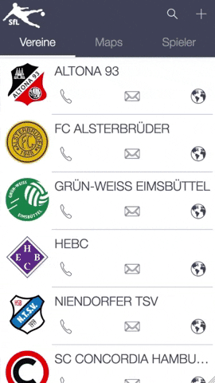

SfL - Soccer for Life creates a portal for amateur soccer players and clubs to get in contact to each other. As a player you have the option to create your own profile and on the other side soccer clubs have the possibility to represent their teams and get a look at new players.

SfL was build as a capstoneproject using React, Node.js, Mongo DB, Mongoose, CSS, Styled Components, Storybook and many more!
